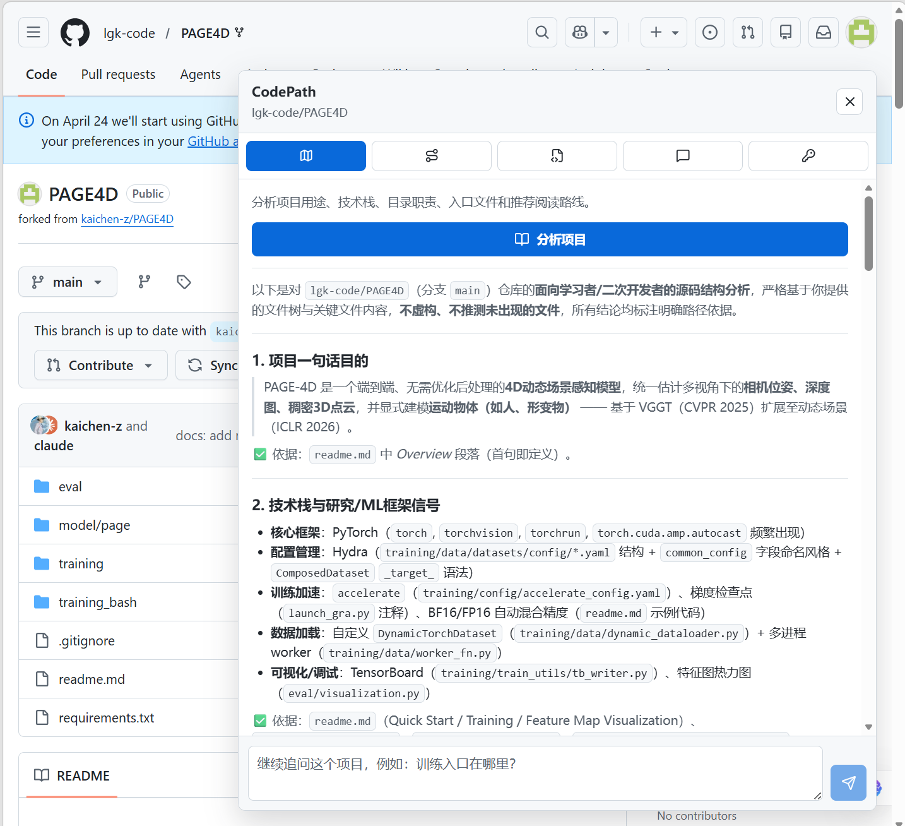

# CodePath Extension

[中文](README.md) | [English](README.en.md)

CodePath is a browser extension for reading GitHub source code. After installation, it adds a sidebar to GitHub repository pages so you can understand project structure, technology stack, feature paths, current files, and follow-up questions without cloning the repository.

## Download and Use

Latest Chrome / Edge extension download:

- [Download CodePath.zip](https://github.com/lgk-code/codepath-extension/releases/latest/download/CodePath.zip)
- [Backup: open the latest Release page](https://github.com/lgk-code/codepath-extension/releases/latest)

Install:

1. Download `CodePath.zip` and unzip it into a stable local folder.
2. Open `chrome://extensions` in Chrome or `edge://extensions` in Edge.
3. Enable Developer mode.
4. Click “Load unpacked” and select the unzipped extension folder.
5. Open any GitHub repository page. The CodePath sidebar appears on the right.

First-time configuration:

- Open the CodePath Settings tab and paste your model API key. First launch defaults to DeepSeek: Base URL `https://api.deepseek.com` and model `deepseek-v4-flash`.
- CodePath detects the API format from the Base URL automatically: DeepSeek/OpenAI-compatible URLs use the OpenAI format, while `api.anthropic.com` or paths containing `/anthropic` use the Anthropic format.
- You can also paste a full `/chat/completions`, `/messages`, or `/models` URL; CodePath normalizes it before saving.
- Click “获取模型” to fetch available models automatically. If `/models` is unavailable, type the model name manually.
- Click Save and Test. CodePath checks the model connection and whether the current API supports streaming output.
- GitHub Token: optional, used for higher GitHub API limits and private repositories.

The Release package does not include any API key or GitHub token. Your secrets are stored only in the current browser extension environment.

## Features

- Shows a resizable CodePath sidebar on GitHub repository pages.
- Analyzes project overview, technology stack, directory roles, entry points, and reading route.
- Analyzes requested feature paths such as login, upload, search, training flow, or cache management.
- Explains the current GitHub file page.
- Supports follow-up questions and contextual suggested questions.
- Renders Markdown, links only analyzed source references back to GitHub files, and detects streaming support.
- Shows answer timing, cache status, and model / GitHub connection diagnostics.

## Demo

Click the screenshot above to open the [CodePath extension demo video](docs/assets/codepath-demo.mp4). The demo site lives in [docs/index.html](docs/index.html) and includes the browser extension flow plus real project analysis examples.

## Development

The project is managed with Git. See the [development guide](docs/DEVELOPMENT.md) for the Windows-native workflow, quality gates, and Edge deployment. See the [MCP guide](docs/MCP_USAGE.md) for server configuration.

## Troubleshooting

- Browser did not update: reload CodePath in `edge://extensions`, then refresh the GitHub page.
- GitHub 404 or private repository: add a GitHub Token with Contents read permission.
- GitHub rate limit: add a GitHub Token and retry.
- Model 401/403: check API Key, model access, and provider account status.
- Model 404: check that the Base URL, API format, and model name match; OpenAI format uses `/chat/completions`, while Anthropic format uses `/messages`.
- Slow answers: check the timing line in each result.
- Streaming looks like a one-shot response: some providers or proxies buffer SSE; CodePath reports realtime, buffered, or unsupported modes. A dispatched streaming request is never replayed automatically after failure; inspect the error before retrying manually.

## Security Notes

CodePath stores your API keys and tokens in browser-local storage for the active extension environment. They are not stored in the repository and are not included in the Release download package. Do not paste real secrets into issues, pull requests, or chat logs.
